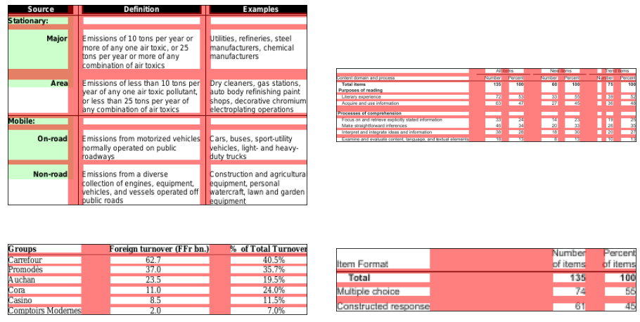

# SPLERGE_via_TF
Implementation of SPLERGE model for table structure recognition via TensorFlow. For reference please check original paper: 

C. Tensmeyer, V. I. Morariu, B. Price, S. Cohen and T. Martinez, "Deep Splitting and Merging for Table Structure Decomposition," 2019 International Conference on Document Analysis and Recognition (ICDAR), 2019, pp. 114-121, doi: 10.1109/ICDAR.2019.00027.

# Usage
To train SPLIT model use script `train_split_model.py`. 
Run with `--help` argument to view usage info.

# Results

I have trained SPLIT model on my machine (NVIDIA GeForce GTX 1080 Ti) for 100 epochs and obtained following results on validation set:

|                   | Intervalwise F-score |
| ----------------- | -------------------- |
| Horz split points | 0.9668               |
| Vert split points | 0.9600               |

# Images

Fig 1. SPLIT model predictions blended with sample table images. 