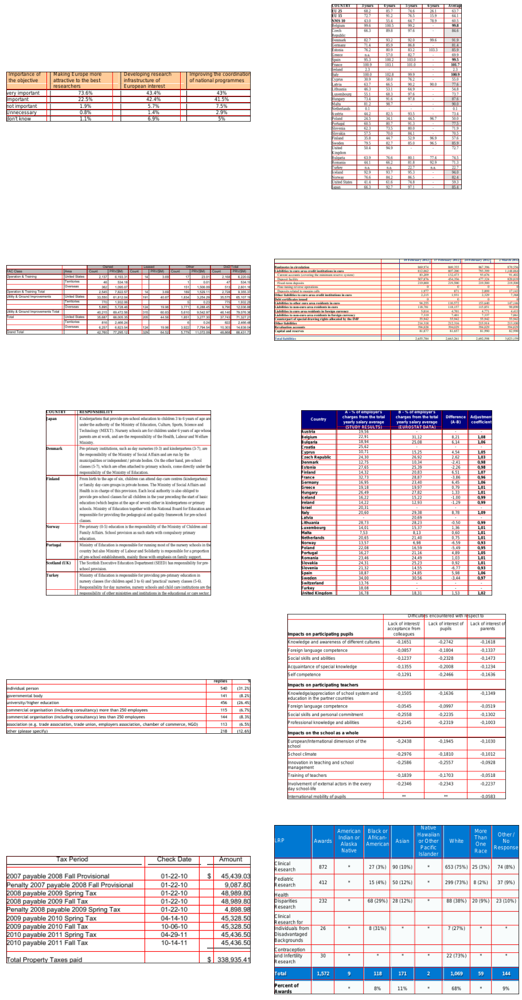

# SPLERGE_via_TF
Implementation of SPLERGE model for table structure recognition via TensorFlow. For reference please check original paper: 

C. Tensmeyer, V. I. Morariu, B. Price, S. Cohen and T. Martinez, "Deep Splitting and Merging for Table Structure Decomposition," 2019 International Conference on Document Analysis and Recognition (ICDAR), 2019, pp. 114-121, doi: 10.1109/ICDAR.2019.00027.

# Installation

1. Install poppler for pdf support: `sudo apt install poppler-utils`.
2. Install python packages: `pip install -r requirements.txt`.

# Usage
To train model use script `train_model.py`.

To evaluate model use script `evaluate_model.py`.

Run with `--help` argument to view usage info.

# Datasets

Currently we implemented 2 datasets: ICDAR 2013 and FinTabNet. 

|Dataset|Train size|Test size|
|-|-|-|
|ICDAR|81|148|
|FinTabNet|91220|10629|

# Results

As the main metric we used ajacency F-score (see [article](https://www.researchgate.net/publication/233954637_A_Methodology_for_Evaluating_Algorithms_for_Table_Understanding_in_PDF_Documents) for more details).

We have trained our models on ICDAR dataset for 100 epochs and on FinTabNet dataset for 5 epochs.

|Model|Train dataset|Test dataset|Adj. F-score|
|-|-|-|-|
|SPLIT|ICDAR|ICDAR|0.5267|
|SPLERGE|ICDAR|ICDAR|0.5295|
|SPLIT|FinTabNet|ICDAR|0.5271|
|SPLERGE|FinTableNet|ICDAR|TBD|
|SPLIT|FinTabNet|FinTabNet|0.8597|
|SPLERGE|FinTabNet|FinTabNet|TBD|

|                   | Train          | Test   |
| ----------------- | ---------------|--------|
| SPLIT             | 0.8863         | 0.5267 |
| SPLIT + MERGE     | 0.8982         | 0.5295 |
| Num of tables     | 81             | 148    |

# Images

Fig 1. SPLERGE model predictions on training set.

# Conclusion

More training data will be helpful to decrease variance.